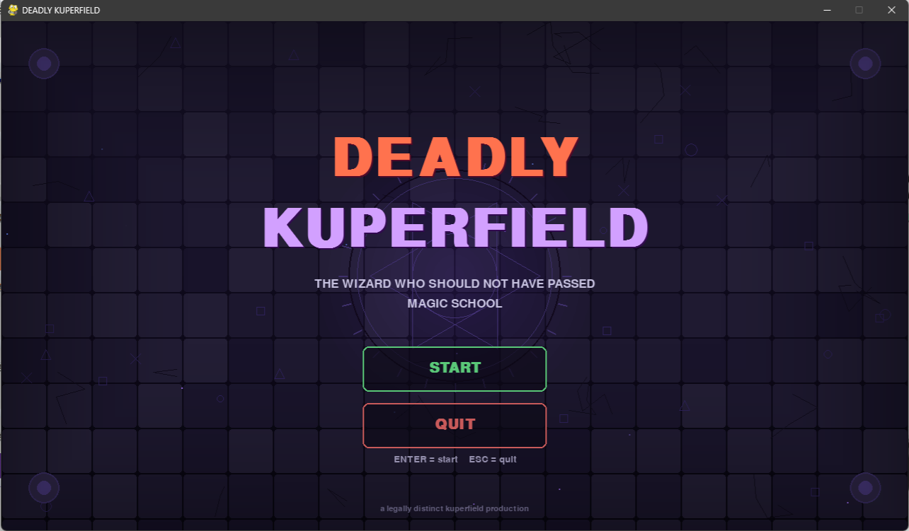

# DEADLY KUPERFIELD

> THE WIZARD WHO SHOULD NOT HAVE PASSED MAGIC SCHOOL



## What is DEADLY KUPERFIELD?

A ridiculous but genuinely playable top-down 2D wizard action game built with
Python + Pygame.

You are **DEADLY KUPERFIELD**, an overdramatic sorcerer full of forbidden
magic and bad decisions.

Survive four waves of balloons, necromancers, and demons, then face
**THE GREAT KUPER** himself in a two-phase boss fight.

No external art assets are required. The wizard, arena, runes, enemies,
projectiles, particles, and visual effects are generated procedurally with
Pygame primitives.

## Requirements

- Python 3.10+
- Pygame

## Installation

```bash
pip install pygame
...

## Running
python main.py

## Controls
|-------------------------------------------------------|
| Input             | Action                            |
| ----------------- | --------------------------------- |
| WASD / Arrow Keys | Move                              |
| Mouse             | Aim                               |
| Left Mouse Button | MAGIC BOLT                        |
| SPACE             | KUPER BLAST                       |
| Q                 | DEADLY NOVA                       |
| E                 | TIME DISINTEGRATOR                |
| ESC               | Pause / Resume                    |
| ENTER             | Start                             |
| 1 / 2 / 3         | Select Level-Up Upgrade           |
| R                 | Restart after Game Over / Victory |
---------------------------------------------------------

## Gameplay
Kill enemies to gain XP and score.
Level up and choose one of three random upgrades.

## Enemies
- BLOON MINION — fast melee enemy
- NECROMANCER — ranged enemy
- KUPER DEMON — large tank enemy

## Waves
- Wave 1 — 5 enemies
- Wave 2 — 8 enemies
- Wave 3 — 12 enemies
- Wave 4 — 15 enemies
- Wave 5 — THE GREAT KUPER

## Boss
THE GREAT KUPER has two phases.
At 50% HP he enters:

## KUPERFURY
and becomes significantly more aggressive.

## Project Structure
deddy_bloonfield/
├── main.py
├── config.py
├── particles.py
├── spells.py
├── player.py
├── enemies.py
├── boss.py
├── game.py
├── ui.py
├── world.py
├── README.md
├── deadly_kuperfield.png
└── .gitignore

## Technical Notes
The project uses:
- delta-time based movement
- normalized movement vectors
- Pygame Vector2 mathematics
- projectile collision
- simple enemy pursuit AI
- ranged enemy behavior
- boss state transitions
- party
- screen shake and flash effects
- procedural sound generation
The project intentionally avoids a large game engine.
It is a small experiment in building a real-time 2D game directly with
Python

## Why?
Because apparently building FEM/PDE/HPC software wasn't quite
unreasonable.
So we built a wizard.

## License
Released under a BLOON UNIVERSITY project license.
© BLOON UNIVERSITY